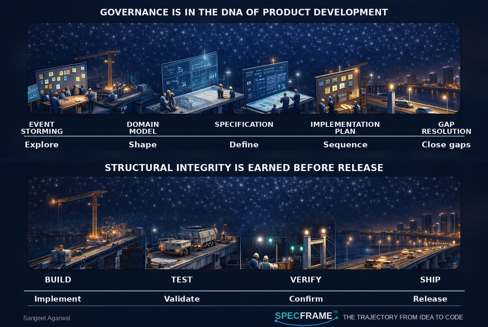

# SpecFrame™

**The trajectory from idea to code.**

[SpecFrame.ai](https://specframe.ai)

<p align="center">
  
</p>

## The Leverage Isn't in the Agents — It's in What You Feed Them

In agentic development, the LLM writes the code. It generates implementation in minutes. The human no longer codes — the human specifies. And the quality of what the LLM produces depends entirely on the quality of what it reads.

SpecFrame is a structured, document-driven workflow where the developer writes the key artifacts and the implementing agent reads them. The human stays in the governance seat.

While writing software by hand, we often led with unit tests. TDD was never just about testing — it was about design: forcing you to define behavior before implementation. In agentic development, that design step has shifted. We now lead with a specification — derived from the PRD, but rigorous in ways PRDs typically aren't asked to be. The spec captures intent, scope, constraints, validation rules, data models, security policies, and acceptance criteria before the LLM generates a single line of code. The PRD doesn't go away; it feeds the spec, and there's no substitute for a well-written PRD — agentic development or otherwise.

The flow becomes:

```
PRD → Specification → Implementation Plan → Gap Resolution → Build → Test → Verify → Ship
```

For complex domains, add Domain-Driven Design upstream:

```
Event Storming → Domain Model → PRD → Specification → Implementation Plan → Gap Resolution → Build → Test → Verify → Ship
```

The event storm and domain model are base artifacts — written once for the domain. PRDs are per-feature, written by Product to capture intent for human stakeholders. Specifications are engineering's translation of each PRD into LLM-readable form — one per feature, what the LLM consumes. The LLM generates an implementation plan from the spec, surfaces open questions for you to answer, and implements against a design you already made.

The LLM's job shrinks from "figure out the domain, design the architecture, and write the code" to just "write the code."

## Getting Started

If you're building a new app from scratch, start with the [Quickstart Guide](docs/guides/specframe-quickstart-new-app.md). It walks through every step from empty repo to verified application.

If you're applying SpecFrame to an existing codebase, run SummonAIKit first to generate project context, then write a specification for your next feature. See the [Scaffolding Guide](docs/guides/scaffolding.md).

If you're a product manager or business stakeholder, start with [SpecFrame for Product Teams](docs/guides/specframe-for-product.md) for orientation, then use the [PRD Template](docs/guides/specframe-prd-template.md) and the [Specification Questionnaire](docs/guides/specification-questionnaire.md) — the fillable artifacts that bridge product intent to engineering implementation.

## Repository Structure

```
specframe/
├── docs/
│   ├── guides/                                # Methodology
│   │   ├── specframe-philosophy.md              # Spec-driven design thesis
│   │   ├── specframe-quickstart-new-app.md      # New app walkthrough
│   │   ├── specframe-for-product.md             # Product-facing intro
│   │   ├── specframe-prd-template.md            # PRD template
│   │   ├── specification.md                     # specification.md convention
│   │   ├── specification-questionnaire.md       # Fillable spec questionnaire
│   │   ├── scaffolding.md                       # SummonAIKit + Context7
│   │   ├── skill-standards.md                   # Building Claude Code skills
│   │   ├── skill-templates/
│   │   │   └── SKILL.md
│   │   └── specification-templates/             # DDD specification templates
│   │       ├── README.md                        # Both approaches explained
│   │       ├── specification-template.md        # Blank master template
│   │       ├── feature-specification-template.md
│   │       └── example/
│   │           ├── single-spec/                 # Approach 1: one file
│   │           │   └── specification.md
│   │           └── multi-spec/                  # Approach 2: master + features
│   │               └── docs/
│   │                   ├── specification.md
│   │                   └── work/
│   │                       ├── feature-sprint-management/
│   │                       │   └── specification.md
│   │                       ├── feature-backlog-management/
│   │                       │   └── specification.md
│   │                       └── feature-discussion-integration/
│   │                           └── specification.md
│   ├── architecture/
│   │   └── adrs/                              # Architecture decisions
│   ├── context/                               # Session summaries
│   │   └── .session-template.md
│   ├── references/                            # Reference materials
│   ├── work/                                  # Feature work folders
│   │   └── README.md
│   ├── architecture-decision-records-guide.md
│   ├── aws-serverless-backend-guide.md
│   ├── claude-code-workflow-guide.md
│   └── copilot-workflow-guide.md
├── scripts/                                   # PowerShell automation
├── .azuredevops/
├── .github/
└── .vscode/
```

## Guides

| Guide | What It Covers |
| --- | --- |
| [SpecFrame Philosophy](docs/guides/specframe-philosophy.md) | Why specifications replace TDD's forcing function in agentic development. The feedback loop, self-improving conventions, and what SpecFrame is not. |
| [Quickstart: New App](docs/guides/specframe-quickstart-new-app.md) | Step-by-step from empty repo to verified app. Directory structure, CLAUDE.md with invariants, specification writing, gap resolution, scaffolding, building in sessions, four-layer verification. |
| [SpecFrame for Product Teams](docs/guides/specframe-for-product.md) | Where the spec sits relative to the PRD and event storming. What the spec adds beyond the PRD. Handoff workflow from Product to engineering. |
| [PRD Template](docs/guides/specframe-prd-template.md) | Fillable PRD template for Product to articulate features before engineering produces the spec. The PRD remains as the upstream artifact in agentic development; there's no substitute for a well-written PRD. |
| [The specification.md Convention](docs/guides/specification.md) | What goes in a specification, what doesn't, external setup, gap resolution with _(gap)_ tags, and verification against the spec. |
| [Feature Specification Questionnaire](docs/guides/specification-questionnaire.md) | Fillable questionnaire that maps 1:1 to the spec format. Filled in after the PRD; the completed document is the spec. |
| [Gap Sweep](docs/guides/specframe-gap-sweep.md) | The inter-phase variant of gap analysis. When verification or post-deploy use reveals drift across multiple prior phase specs, run a Gap Sweep — inventory findings, edit affected prior specs in place, sequence the fixes as a dedicated phase. Triggers, naming convention, anti-patterns. |
| [Gap Sweep Inventory Template](docs/guides/specframe-gap-sweep-template.md) | Template for the inventory artifact that distinguishes a Gap Sweep from ad-hoc fixing. Findings table, decisions per finding, map of touched artifacts, cross-cutting pattern observations. |
| [Scaffolding](docs/guides/scaffolding.md) | SummonAIKit generates project context and skills from your codebase. Context7 provides live documentation during sessions. How they complement SpecFrame. |
| [Skill-Building Standards](docs/guides/skill-standards.md) | How to build Claude Code skills. Folder structure, YAML frontmatter, progressive disclosure, testing, and a full TOTP walkthrough. |
| [DDD Specification Templates](docs/guides/specification-templates/) | DDD-driven specification templates with blank templates for master and feature specs, plus a case study using Vernon's Scrum Project Management Software example. |
| [Claude Code Workflow](docs/claude-code-workflow-guide.md) | Terminal-first development with Claude Code CLI. Session management, hooks, context strategies. |
| [Copilot Workflow](docs/copilot-workflow-guide.md) | GitHub Copilot + Visual Studio workflow. PowerShell scripts, session management, Azure DevOps integration. |
| [ADR Guide](docs/architecture-decision-records-guide.md) | When and how to document architecture decisions. |
| [AWS Serverless Backend](docs/aws-serverless-backend-guide.md) | Lambda, API Gateway, DynamoDB, custom domains, hardening. |

## Key Concepts

**Specification as source of truth.** No other artifact — implementation plan, code, config, or test — may introduce information not already in the specification. When any artifact would introduce new information, update the specification first.

**The PRD remains.** SpecFrame doesn't replace the PRD; it adds the specification as a downstream artifact. The PRD captures product intent for human stakeholders in product language. The specification restates that intent as an LLM-readable directive with the rigor PRDs don't typically carry. Conventional requirements practices don't change — a well-written PRD remains essential.

**Gap resolution.** When the LLM generates an implementation plan, it surfaces gaps — decisions the spec didn't address. Gaps are written into the specification first, then referenced in the plan. Resolved gaps are tagged _(gap)_ so you can track what was upfront vs. surfaced during planning. Over time, the pattern of gaps reveals missing sections in your specification template.

**Gap sweep.** Some gaps surface only between phases — drift across multiple prior phase specs that each shipped coherent-internally but together produced an incoherent system. A Gap Sweep is a deliberate inter-phase phase that inventories cross-phase findings, decides each one (resolve, defer, reject), edits the affected prior specs in place (tagged with the sweep's phase letter), and sequences the work into a fresh implementation plan. Same gap discipline as intra-phase resolution, applied across the artifact stack. Triggered by verification inconsistencies, two phases touching the same surface, pre-launch, or an accumulating observation backlog — never scheduled. Folder name follows `v<version>-<trigger>-gap-sweep` (e.g., `v1-2c-gap-sweep`, `v1-pre-launch-gap-sweep`).

**External setup.** Steps requiring manual action outside the LLM (creating accounts, configuring OAuth, copying API keys) are listed explicitly in the specification. The LLM cannot say "feature complete" without surfacing all remaining human tasks.

**Session summaries.** Each session ends with a summary of what was accomplished, what decisions were made, and what remains. The next session reads the summary and picks up where you left off. This solves the biggest problem in AI-assisted development: context loss between sessions.

**Four-layer verification.** Unit/integration tests verify application logic. E2E data layer tests verify real database constraints and security policies. Specification verification walks the spec feature by feature confirming the implementation satisfies each requirement. Perspective assessment feeds the specification and key source files to Claude with Research enabled, evaluating from multiple professional perspectives to surface blind spots the other layers miss.

**Self-improving conventions.** Every project reveals gaps in the methodology. Each problem encountered becomes a convention that prevents that class of problems across all future work. The specification template grows. The CLAUDE.md rules accumulate. The methodology improves with every build.

## SpecFrame Under Usage-Based Pricing

The economics of agentic development shifted in 2026. GitHub Copilot, Salesforce Agentforce, and others moved decisively to usage-based billing — credits, tokens, and model multipliers that surface the real cost of frontier-tier work. Fixed-price all-you-can-eat plans are ending. The cost of "fix all the bugs and make it better" prompts on top-tier models became visible to the engineers running them.

SpecFrame was designed for discipline before this shift. It now also turns out to be the cost-rational way to work.

**Cache hit economics.** Every CLI session reads the same prefix — `CLAUDE.md`, `stack-context.md`, `domain.md`, the active phase spec, the active phase plan — in the same order. That stable prefix is a perfect cacheable input. Cached input is 50–90% cheaper than uncached across providers. Vibe-coded sessions have novel prompts every time and capture none of this discount. Over a project's lifetime, the cost gap compounds.

**Intentional tier routing per step.** Each numbered step has a defined goal, scope, and verification criteria. That makes "is this Haiku work or Opus work?" a tractable question at step boundary. Frontier-tier reserved for hard reasoning, novel architecture, and agentic flows; smaller tiers (Sonnet, Haiku) for routine spec edits and code generation; open-weights models for tasks where good-enough fits. Vibe coding has no step boundaries; it defaults to top-tier on everything.

**ROI legibility per step.** Each step produces a step-completion artifact — a measurable unit of work with code changes, verification evidence, and time cost. Engineering managers asking for ROI on AI investment now have artifact-level evidence per step rather than aggregate vibes. The pattern across recent ROI conversations is consistent: time-savings are easier to measure on large tasks than small. SpecFrame's step is the right size of unit — large enough to make savings visible, small enough to keep artifacts tractable.

**Rework prevention.** Spec-first, gap discipline, audit, and write-back catch misalignment before code-generation cycles compound. Rework is the most expensive form of compute spend in agentic development — implement, discover spec mismatch, redo, re-audit. SpecFrame's stack is the early-warning system that stops the compounding cycle.

**No "agent loose in the codebase."** SpecFrame's "one numbered step per session, write the completion report, stop" rule means the agent cannot accidentally rampage across the repo making 47 unrelated changes from a vague prompt. That is the exact failure mode usage-based pricing is meant to kill.

The positioning shifted with the market. Before usage-based billing, SpecFrame was a values argument — methodology for teams that cared about discipline. Under usage-based billing, it is an economics argument — the cost-rational way to do agentic development. The market did not change SpecFrame; it caught up to it.

## When to Add DDD

For straightforward CRUD apps, a specification is sufficient. For complex domains with multiple actors, bounded contexts, and intricate business rules, add Domain-Driven Design upstream of the specification.

Event Storming and domain modeling surface the business language, boundaries, invariants, and policies before any technical decisions. These produce a domain model that feeds directly into the specification. The event storm and domain model are base artifacts — you write them once for the domain, then write specifications against them.

### DDD Specification Templates

The [specification-templates/](docs/guides/specification-templates/) folder provides templates and worked examples for writing DDD-informed specifications that agents consume directly. The templates use DDD vocabulary as precise instructions — aggregate root, invariant, value object, domain event — because the agent already understands these terms. Each one is a compressed instruction set that eliminates implementation decisions the agent might get wrong.

**Two approaches are provided:**

**Single specification** — one `specification.md` containing the complete domain model. All bounded contexts, aggregates, the full context map, and all domain events in a single file. The agent reads everything, generates an implementation plan, surfaces gaps for you to resolve, and builds from the whole picture. Faster to set up, fewer files to manage. Use this for small to medium projects with one or two bounded contexts. The tradeoff: the agent processes the entire domain on every task, which works until the domain grows large enough that the agent starts making mistakes at the edges.

**Master plus feature specifications** — a master `specification.md` with the complete domain model, plus extracted feature-level specs scoped to a single bounded context or aggregate. The master and the feature spec are identical in structure — the feature spec is just a slice. The agent reads only the slice relevant to its current task, generates an implementation plan against that scope, and surfaces gaps for you to resolve — all within the feature spec, then folded back into the master. This means the agent's job is smaller and more focused on each task. The result is more accurate implementation, clearer boundaries on what the agent should and should not touch, and — critically — easier debugging in production. When something breaks, the feature spec tells you exactly which aggregate, which invariants, and which cross-context contracts were in play. You don't search the entire domain model to find the relevant rules. The tradeoff: slower to set up because extraction is human work, and you maintain more files. Use this for complex projects with three or more bounded contexts or parallel development.

Both approaches include a case study based on a Scrum Project Management Software example drawn from Vaughn Vernon's _Domain-Driven Design Distilled_ (Addison-Wesley, 2016). The case study demonstrates three bounded contexts (Agile PM, Collaboration, Identity & Access) with distinct ubiquitous languages, cross-context domain events, ACL translations, and identity that appears differently in each context.

## Status

The core workflow is in use — specifications, gap resolution, session summaries, scaffolding with SummonAIKit and Context7, and four-layer verification. The lessons learned from building real projects become conventions and rules in this repo.

The Event Storming and DDD specification templates are the latest additions. Product-facing artifacts — the PRD template, the specification questionnaire, and the Product-team intro — were added when real organizational use revealed that the PRD ↔ Spec boundary needed an explicit doc. This methodology is being built in the open. What works stays. What doesn't gets revised.

## License

MIT — see [LICENSE](LICENSE).
